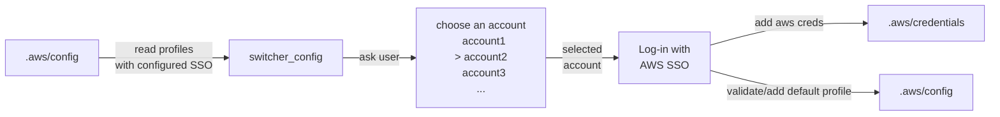
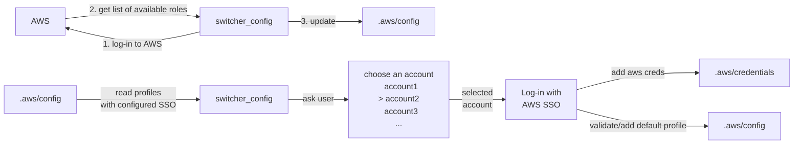
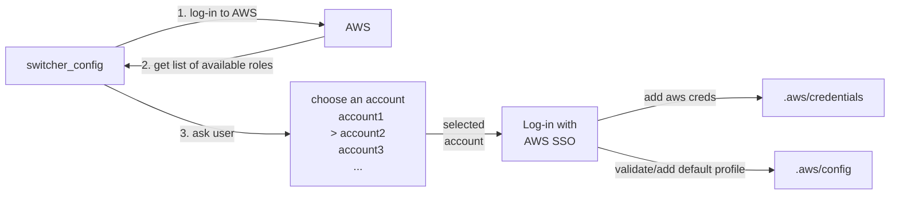

# account-switcher

Scripts to simplify switching between accounts.

Requires `boto3`, `InquirerPy` and `aws_sso_lib`

Use [aws_sso_lib](https://github.com/benkehoe/aws-sso-util/tree/master/lib) library to programmatically interact with AWS SSO. 

`switcher_config.py` - reads `~/.aws/config` file, to select configured profile, then logins to the profile and update `~/.aws/credentials` file with *aws_access_key_id/aws_secret_access_key/aws_session_token* using default profile 

Available options for the script. Need only to update config file: 

```bash
  --update              Update aws config file with accessible accounts/roles
  --sso_start_url TEXT  URL that points to the organization's AWS SSO user
                        portal. Required if use --update flag
  --aws_config TEXT     AWS configuration file location. Defaults to
                        '~/.aws/config
  --sso_region TEXT     The AWS Region that contains the AWS SSO portal host.
                        Default 'us-east-1'
  --region TEXT         AWS Region to send requests to for commands requested
                        using this profile. Default 'us-east-1'
```



`switcher_config.py --update --sso_start_url=https://my-sso-portal.awsapps.com/start`


`switcher_sso.py` - log in to AWS, gets list of available roles for the user, then update `~/.aws/credentials` file with *aws_access_key_id/aws_secret_access_key/aws_session_token* using default profile. Takes a bit more time to run, because of connecting to aws and listing available accounts and roles 


